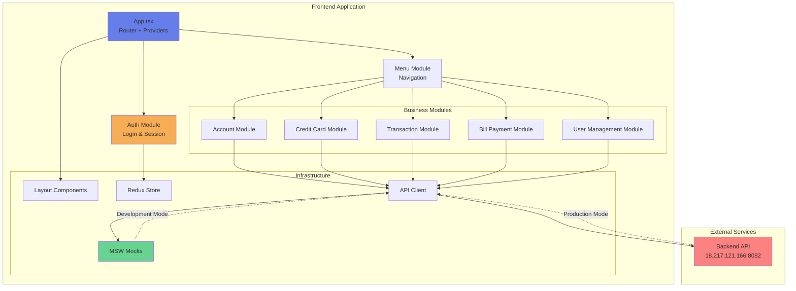

# SAI Application System - Overview for User Stories

Version: 2026-01-26
Purpose: Single source of truth for creating well-structured User Stories

## 📊 Platform Statistics

- **Modules**: 9 documented modules
- **Code Reuse**: 85% reusable components with Material-UI
- **UI Components**: 50+ available components across modules
- **API Coverage**: 100% documented endpoints with MSW mocks
- **Supported Languages**: English (UI ready for i18n expansion)
- **Testing**: MSW-based mocking system with 10 sample accounts

## 🏗️ High-Level Architecture

### Technology Stack

- **Frontend**: React 18.3.1 + TypeScript 5.4.5
- **State Management**: Redux Toolkit 2.2.3
- **Routing**: React Router DOM 6.22.3
- **UI Library**: Material-UI 5.15.15 + Emotion
- **Build Tool**: Vite 5.2.10
- **Development**: MSW 2.2.13 for API mocking
- **Deployment**: Docker + Nginx (production-ready)

### Architectural Patterns

- **Component Architecture**: Feature-based organization with shared UI components
- **State Management**: Redux Toolkit with slice pattern for modular state
- **Service Layer**: API abstraction with axios-based client
- **Custom Hooks**: Business logic encapsulation (useApi, useSecureSession, domain-specific hooks)
- **Protected Routes**: Role-based access control (admin, back-office)
- **Authentication**: Token-based with localStorage persistence
- **Error Handling**: ErrorBoundary with graceful degradation
- **Code Splitting**: React.lazy for route-based code splitting

### Deployment Architecture

\`\`\`
Frontend (React + Vite)
 Development: Vite dev server (port 3000) with HMR
 Production: Static build served by Nginx
 API Proxy: /api → Backend (http://18.217.121.166:8082)
\`\`\`


## 📚 Module Catalog

### AUTH - Authentication & Authorization

- **ID**: auth
- **Purpose**: User authentication, session management, and role-based access control
- **Key Components**:
  - `LoginPage`: Login form with credential validation
  - `ProtectedRoute`: Route guard with role verification
  - `authSlice`: Redux state for authentication
  - `useSecureSession`: Hook for secure session management with auto-logout
- **Public APIs**:
  - `POST /auth/login` - User authentication with credentials
  - Returns: `{ accessToken, refreshToken, userId, fullName, userType, expiresIn }`
- **US Examples**:
  - As a back-office user, I want to log in securely to access the system
  - As a system administrator, I want sessions to expire after inactivity for security
  - As a user, I want my session to persist across page refreshes

### ACCOUNT - Account Management

- **ID**: account
- **Purpose**: View and update customer account information
- **Key Components**:
  - `AccountViewScreen`: Display account details with customer and card info
  - `AccountUpdateScreen`: Update account information with validation
  - `useAccountView`: Hook for fetching account details
  - `useAccountUpdate`: Hook for updating account information
- **Public APIs**:
  - `GET /accounts/view?accountId={id}` - Retrieve account details with customer and card info
  - `POST /accounts/update` - Update account information
- **US Examples**:
  - As a back-office user, I want to view complete account details to assist customers
  - As a back-office user, I want to update account information when customer details change
  - As a user, I want to see all credit cards associated with an account

### CREDITCARD - Credit Card Management

- **ID**: creditCard
- **Purpose**: List, view, and update credit card information
- **Key Components**:
  - `CreditCardListScreen`: Paginated card list with search
  - `CreditCardDetailScreen`: Detailed card view with account info
  - `CreditCardUpdateScreen`: Update card details with validation
  - `useCreditCardList`: Hook for fetching card list with pagination
  - `useCreditCardDetail`: Hook for card details
  - `useCreditCardUpdate`: Hook for updating card info
- **Public APIs**:
  - `GET /cards/list?page={page}&limit={limit}` - List cards with pagination
  - `GET /cards/detail?cardNumber={number}` - Get card details
  - `POST /cards/update` - Update card information
- **US Examples**:
  - As a back-office user, I want to search and filter credit cards to find specific accounts
  - As a back-office user, I want to view card details to verify customer information
  - As a back-office user, I want to update card status when cards are lost or stolen

### TRANSACTION - Transaction Management

- **ID**: transaction
- **Purpose**: View, add, and generate reports for financial transactions
- **Key Components**:
  - `TransactionListScreen`: Paginated transaction list
  - `TransactionViewScreen`: Detailed transaction view
  - `TransactionAddScreen`: Add new transaction with validation
  - `TransactionReportsScreen`: Generate transaction reports by date range
  - `TransactionReportTable`: Display report data in table format
  - `useTransactionList`: Hook for transaction listing
  - `useTransactionView`: Hook for transaction details
  - `useTransactionAdd`: Hook for adding transactions
  - `useTransactionReports`: Hook for generating reports
- **Public APIs**:
  - `GET /transactions/list?page={page}&limit={limit}` - List transactions
  - `GET /transactions/view?transactionId={id}` - Get transaction details
  - `POST /transactions/add` - Add new transaction
  - `GET /reports/transactions?startDate={date}&endDate={date}` - Generate reports
- **US Examples**:
  - As a back-office user, I want to view transaction history to track account activity
  - As a back-office user, I want to add manual transactions for adjustments
  - As a back-office user, I want to generate reports by date range for analysis
  - As a back-office user, I want to view detailed transaction information for dispute resolution

### BILLPAYMENT - Bill Payment Processing

- **ID**: billPayment
- **Purpose**: Process bill payments from credit card accounts
- **Key Components**:
  - `BillPaymentScreen`: Payment form with account and amount validation
  - `useBillPayment`: Hook for processing payments
- **Public APIs**:
  - `POST /payments/bills` - Process bill payment
  - Request: `{ accountId, amount, paymentDate, description }`
  - Response: `{ success, transactionId, confirmationNumber }`
- **US Examples**:
  - As a back-office user, I want to process bill payments for customer accounts
  - As a back-office user, I want to validate account status before processing payments
  - As a back-office user, I want to receive confirmation numbers for processed payments

### USER - User Management (Admin)

- **ID**: user
- **Purpose**: Manage system users (admin-only functionality)
- **Key Components**:
  - `UserListScreen`: List all system users
  - `UserAddScreen`: Create new users with role assignment
  - `UserUpdateScreen`: Update user information
  - `UserDeleteScreen`: Delete users from system
  - `useUserList`: Hook for fetching user list
  - `useUserAdd`: Hook for adding users
  - `useUserUpdate`: Hook for updating users
  - `useUserDelete`: Hook for deleting users
- **Public APIs**:
  - `GET /admin/users/list` - List all users
  - `POST /admin/users/add` - Create new user
  - `PUT /admin/users/update` - Update user info
  - `DELETE /admin/users/delete?userId={id}` - Delete user
- **US Examples**:
  - As an administrator, I want to create new back-office users to expand the team
  - As an administrator, I want to update user roles to manage permissions
  - As an administrator, I want to deactivate users who leave the organization
  - As an administrator, I want to view all system users to manage access

### MENU - Navigation & Menus

- **ID**: menu
- **Purpose**: Main navigation and menu system with role-based options
- **Key Components**:
  - `MenuScreen`: Reusable menu component with role filtering
  - `MainMenuPage`: Back-office user menu
  - `AdminMenuPage`: Administrator menu
  - `useMenu`: Hook for fetching menu options
- **Public APIs**:
  - `GET /menu?role={role}` - Get menu options for role
- **US Examples**:
  - As a back-office user, I want to see menu options relevant to my role
  - As an administrator, I want to access additional admin-only menu options
  - As a user, I want to navigate easily between system functions

### LAYOUT - Layout & UI Components

- **ID**: layout
- **Purpose**: Shared layout components and system-wide UI elements
- **Key Components**:
  - `SystemHeader`: App header with user info and logout
  - `ErrorBoundary`: Error boundary for graceful error handling
  - `LoadingSpinner`: Consistent loading indicator
  - `ThemeToggle`: Theme switching capability
- **US Examples**:
  - As a user, I want a consistent header across all pages
  - As a user, I want to see who is logged in at all times
  - As a user, I want a clear way to log out of the system

### CORE - Core Infrastructure

- **ID**: core
- **Purpose**: Core services, utilities, and infrastructure
- **Key Components**:
  - `apiClient`: Centralized API client with interceptors
  - `store`: Redux store configuration
  - `AppProviders`: Root providers (Redux, Router, Theme)
  - `useApi`: Generic API hook with loading/error states
  - `useLocalStorage`: Type-safe localStorage hook
  - **MSW Mocks**: Complete mock handlers for development
- **US Examples**:
  - As a developer, I want centralized API error handling for consistency
  - As a developer, I want to develop features without backend dependencies
  - As a developer, I want type-safe state management across the application

## 🔄 Architecture Diagram



## 📊 Data Models

### User

```typescript
interface User {
  userId: string;
  fullName: string;
  userType: string; // 'A' (Admin) | 'U' (User)
  role: 'admin' | 'back-office';
  status: string;
  createdDate: string;
  lastLoginDate: string;
}
```

### Account

```typescript
interface Account {
  accountId: string;
  customerId: string;
  currentBalance: number;
  creditLimit: number;
  accountStatus: string; // 'Y' (Active) | 'N' (Inactive)
  
  // Customer information
  customer: {
    customerId: string;
    firstName: string;
    middleName: string;
    lastName: string;
    dateOfBirth: string;
    ssnTaxId: string;
    ficoScore: number;
    phoneNumbers: Array<{ phoneType: string; phoneNumber: string }>;
    address: {
      addressLine1: string;
      addressLine2: string;
      city: string;
      state: string;
      zipCode: string;
      country: string;
    };
  };
  
  // Cards associated with account
  cards: CreditCard[];
}
```

### CreditCard

```typescript
interface CreditCard {
  cardNumber: string;
  accountId: string;
  embossedName: string;
  expiryDate: string;
  cvvCode: string;
  cardStatus: string; // 'ACTIVE' | 'INACTIVE' | 'EXPIRED'
  cardType: string;
  issueDate: string;
}
```

### Transaction

```typescript
interface Transaction {
  transactionId: string;
  cardNumber: string;
  transactionType: string;
  transactionCategory: string;
  transactionAmount: number;
  transactionDescription: string;
  transactionDate: string;
  merchantName: string;
  merchantCity: string;
  authorizationCode: string;
  status: string;
}
```

### BillPayment

```typescript
interface BillPayment {
  accountId: string;
  amount: number;
  paymentDate: string;
  description: string;
}
```

## 📋 Business Rules by Module

### AUTH - Authentication Rules

- Users must provide valid userId and password
- Sessions expire after 30 minutes of inactivity
- Token stored in localStorage for persistence
- Failed login attempts do not lock accounts (handled by backend)
- Role-based access: `admin` users can access admin routes, `back-office` users restricted to standard routes

### ACCOUNT - Account Management Rules

- Account ID must be 11 digits
- Only active accounts can be modified
- Customer information updates require validation
- Balance and credit limit are read-only (updated via transactions)
- Account status changes require admin approval

### CREDITCARD - Credit Card Rules

- Card numbers follow standard credit card format (13-19 digits)
- CVV codes are masked for security (display only last 3 digits)
- Expired cards cannot be used for transactions
- Card status must be 'ACTIVE' for new transactions
- Each account can have multiple cards
- Card number format displayed with hyphens for readability

### TRANSACTION - Transaction Rules

- Transaction amounts must be positive (credits) or negative (debits)
- Transaction date cannot be in the future
- Each transaction must be linked to a valid card
- Transaction categories follow ISO 18245 MCC codes
- Reports can be generated for date ranges up to 1 year
- Transaction IDs are system-generated and immutable

### BILLPAYMENT - Bill Payment Rules

- Payment amount must be positive and greater than zero
- Account must be active to process payments
- Payment date can be current date or future date
- Payments generate a transaction record
- Confirmation number generated for each successful payment

### USER - User Management Rules

- User IDs must be unique across the system
- Admin users can create/update/delete other users
- Cannot delete currently logged-in user
- User type 'A' maps to admin role, 'U' maps to back-office role
- Password requirements enforced by backend
- User status affects login ability (Inactive users cannot login)

## 🌐 Frontend Patterns

### Component Architecture

**Pattern**: Direct Implementation (no base components)

Project uses feature-specific components with Material-UI as the base library.

```
app/
 components/
   ├── account/           # Account-specific components
   │   ├── AccountViewScreen.tsx
   │   └── AccountUpdateScreen.tsx
   ├── creditCard/        # Credit card components
   │   ├── CreditCardListScreen.tsx
   │   ├── CreditCardDetailScreen.tsx
   │   └── CreditCardUpdateScreen.tsx
   ├── transaction/       # Transaction components
   │   ├── TransactionListScreen.tsx
   │   ├── TransactionViewScreen.tsx
   │   ├── TransactionAddScreen.tsx
   │   ├── TransactionReportsScreen.tsx
   │   └── TransactionReportTable.tsx
   ├── user/              # User management components
   │   ├── UserListScreen.tsx
   │   ├── UserAddScreen.tsx
   │   ├── UserUpdateScreen.tsx
   │   └── UserDeleteScreen.tsx
   ├── billPayment/
   │   └── BillPaymentScreen.tsx
 menu/   ├
   │   └── MenuScreen.tsx
   ├── layout/
   │   └── SystemHeader.tsx
   ├── auth/
   │   └── ProtectedRoute.tsx
   └── ui/                # Shared UI utilities
       ├── ErrorBoundary.tsx
       ├── LoadingSpinner.tsx
       └── ThemeToggle.tsx
 pages/                 # Page-level components
   └── [Feature]Page.tsx
 hooks/                 # Custom hooks per feature
    └── use[Feature].ts
```

### Form Pattern

Forms are implemented directly in feature components using Material-UI components:

- **UI Library**: Material-UI (@mui/material 5.15.15)
- **Form Implementation**: Direct in component, no form library
- **Validation**: Custom validation logic in hooks
- **Error Handling**: State-based error display with Material-UI helpers
- **Submission**: Async handling via custom hooks (useApi pattern)

**Example Structure**:

```tsx
import { Box, TextField, Button, Typography } from '@mui/material';
import { useState } from 'react';
import { useApi } from '~/hooks/useApi';

function FeatureForm() {
  const [formData, setFormData] = useState({ field: '' });
  const { execute, loading, error } = useApi();
  
  const handleSubmit = async (e) => {
    e.preventDefault();
    await execute(() => apiClient.post('/endpoint', formData));
  };
  
  return (
    <Box component="form" onSubmit={handleSubmit}>
      <TextField
        label="Field Label"
        value={formData.field}
        onChange={(e) => setFormData({ ...formData, field: e.target.value })}
        error={!!error}
        helperText={error?.message}
      />
      <Button type="submit" disabled={loading}>Submit</Button>
    </Box>
  );
}
```

### List/Table Pattern

Lists use Material-UI components with custom pagination:

- **Table Component**: Material-UI Table, TableContainer, TablePagination
- **Data Display**: Tabular format with sortable headers
- **Pagination**: Client-side or server-side pagination
- **Actions**: Icon buttons for edit/view/delete actions
- **Search**: TextField with debounced search

**Example Structure**:

```tsx
import { 
  Table, TableBody, TableCell, TableContainer, 
  TableHead, TableRow, Paper, IconButton, TablePagination 
} from '@mui/material';
import { Edit, Delete, Visibility } from '@mui/icons-material';

function FeatureList({ items, onEdit, onDelete, onView }) {
  const [page, setPage] = useState(0);
  const [rowsPerPage, setRowsPerPage] = useState(10);
  
  return (
    <TableContainer component={Paper}>
      <Table>
        <TableHead>
          <TableRow>
            <TableCell>Column 1</TableCell>
            <TableCell>Column 2</TableCell>
            <TableCell align="right">Actions</TableCell>
          </TableRow>
        </TableHead>
        <TableBody>
          {items.slice(page * rowsPerPage, page * rowsPerPage + rowsPerPage).map((item) => (
            <TableRow key={item.id}>
              <TableCell>{item.field1}</TableCell>
              <TableCell>{item.field2}</TableCell>
              <TableCell align="right">
                <IconButton onClick={() => onView(item)}><Visibility /></IconButton>
                <IconButton onClick={() => onEdit(item)}><Edit /></IconButton>
                <IconButton onClick={() => onDelete(item)}><Delete /></IconButton>
              </TableCell>
            </TableRow>
          ))}
        </TableBody>
      </Table>
      <TablePagination
        component="div"
        count={items.length}
        page={page}
        onPageChange={(e, newPage) => setPage(newPage)}
        rowsPerPage={rowsPerPage}
        onRowsPerPageChange={(e) => setRowsPerPage(parseInt(e.target.value, 10))}
      />
    </TableContainer>
  );
}
```

### Notification Pattern

- **Implementation**: Material-UI Snackbar (to be implemented)
- **Current**: Console logging and error states
- **Recommended**: Add global Snackbar provider for toast notifications

### State Management Pattern

- **Global State**: Redux Toolkit with slice pattern
- **Component State**: React useState for local UI state
- **API State**: Custom hooks with useApi pattern
- **Persistence**: localStorage via useLocalStorage hook

### Custom Hook Pattern

All business logic encapsulated in custom hooks:

```typescript
// Generic API hook pattern
export const useApi = <T>() => {
  const [data, setData] = useState<T | null>(null);
  const [loading, setLoading] = useState(false);
  const [error, setError] = useState<Error | null>(null);
  
  const execute = async (apiCall: () => Promise<T>) => {
    setLoading(true);
    setError(null);
    try {
      const result = await apiCall();
      setData(result);
      return result;
    } catch (err) {
      setError(err as Error);
      throw err;
    } finally {
      setLoading(false);
    }
  };
  
  return { data, loading, error, execute };
};
```

### Routing Pattern

- **Library**: React Router DOM v6
- **Protection**: ProtectedRoute wrapper component
- **Role-Based**: Routes filtered by user role
- **Code Splitting**: React.lazy for all pages
- **Fallback**: LoadingSpinner during lazy load

## 🎯 User Story Patterns

### Templates by Domain

#### Authentication Stories

Pattern: As [persona] I want [action] for [value]

- Example 1: As a back-office user, I want to log in with my credentials to access the system securely
- Example 2: As a system user, I want my session to expire after inactivity to protect sensitive data
- Example 3: As a user, I want to be redirected to my role-appropriate menu after login

#### Account Management Stories

- Example 1: As a back-office user, I want to view complete account details including customer and card information to assist customers effectively
- Example 2: As a back-office user, I want to update account information when customer details change
- Example 3: As a back-office user, I want to see account status clearly to determine if I can perform operations

#### Credit Card Stories

- Example 1: As a back-office user, I want to list all credit cards with pagination to find specific cards quickly
- Example 2: As a back-office user, I want to view detailed card information to verify customer data
- Example 3: As a back-office user, I want to update card status when cards are lost or stolen

#### Transaction Stories

- Example 1: As a back-office user, I want to view transaction history to track account activity
- Example 2: As a back-office user, I want to add manual transactions for account adjustments
- Example 3: As a back-office user, I want to generate reports by date range for analysis and auditing

#### Bill Payment Stories

- Example 1: As a back-office user, I want to process bill payments from customer accounts
- Example 2: As a back-office user, I want to validate account status before processing payments
- Example 3: As a back-office user, I want to receive confirmation numbers for successful payments

#### User Management Stories (Admin)

- Example 1: As an administrator, I want to create new back-office users to expand the team
- Example 2: As an administrator, I want to update user roles to manage permissions appropriately
- Example 3: As an administrator, I want to deactivate users who leave the organization

### Story Complexity

- **Simple (1-2 pts)**: CRUD operations with existing patterns, UI updates, simple validations
  - Examples: View account details, List credit cards, Update user information
  
- **Medium (3-5 pts)**: Business logic + validation, form submissions, error handling, API integration
  - Examples: Add transaction with validation, Update card status with business rules, Process bill payment
  
- **Complex (5-8 pts)**: Multi-step workflows, multiple API calls, complex state management, role-based logic
  - Examples: Complete account update with customer and card info, Generate comprehensive reports with multiple filters, User management with role transitions

### Acceptance Criteria Patterns

- **Authentication**: Must validate credentials, handle invalid login, store token securely, redirect based on role
- **Validation**: Must verify required fields, enforce business rules, display clear error messages, prevent invalid submissions
- **Performance**: Must load within 2 seconds, handle pagination efficiently, minimize API calls
- **Error**: Must display user-friendly error messages, handle network failures gracefully, provide retry mechanisms
- **Security**: Must protect routes by role, expire sessions after inactivity, sanitize user inputs
- **Accessibility**: Must be keyboard navigable, provide ARIA labels, support screen readers

## ⚡ Performance Budgets

- **Loading Time**: < 2s (First Contentful Paint)
- **API Response**: < 500ms (P95) for list operations
- **API Response**: < 200ms (P95) for detail operations
- **Bundle Size**: Main chunk < 200KB (currently optimized with code splitting)
- **Time to Interactive**: < 3s on 3G connection
- **Mock Latency**: 300-800ms (configurable for development)

## 🚨 Readiness Considerations

### Technical Risks

- **RISK-1**: Backend API availability → Mitigation: MSW mocks for development
- **RISK-2**: Session management across tabs → Mitigation: useSecureSession hook with localStorage sync
- **RISK-3**: Large data sets performance → Mitigation: Server-side pagination, lazy loading
- **RISK-4**: Browser compatibility → Mitigation: Modern browser requirement (ES2020+)

### Tech Debt

- **DEBT-1**: No i18n implementation → Resolution: Add vue-i18n or react-i18n library
- **DEBT-2**: Limited error boundary coverage → Resolution: Add error boundaries to major sections
- **DEBT-3**: No global notification system → Resolution: Implement Material-UI Snackbar provider
- **DEBT-4**: Limited test coverage → Resolution: Add Jest + React Testing Library
- **DEBT-5**: Hard-coded API base URL in proxy → Resolution: Environment-based configuration

### US Sequencing

**Prerequisites**:
1. Authentication module must be complete before any protected features
2. Menu system must be implemented before feature navigation
3. Core infrastructure (API client, hooks) must be stable

**Recommended Order**:
1. Phase 1: Authentication & Core (Login, Session, Protected Routes)
2. Phase 2: Navigation (Menu System, Layout)
3. Phase 3: Read-Only Features (Account View, Card List, Transaction List)
4. Phase 4: Update Features (Account Update, Card Update)
5. Phase 5: Create Features (Transaction Add, Bill Payment)
6. Phase 6: Reporting (Transaction Reports)
7. Phase 7: Admin Features (User Management)

## ✅ Task List

### Completed

- [x] DS3A-1: Initial project setup with React + TypeScript + Vite
- [x] DS3A-2: Authentication module with login and session management
- [x] DS3A-3: Redux store setup with auth slice
- [x] DS3A-4: Protected routes with role-based access
- [x] DS3A-5: Menu system for navigation
- [x] DS3A-6: MSW mock implementation for all APIs
- [x] DS3A-7: Account management (view, update)
- [x] DS3A-8: Credit card management (list, view, update)
- [x] DS3A-9: Transaction management (list, view, add, reports)
- [x] DS3A-10: Bill payment functionality
- [x] DS3A-11: User management (admin only)
- [x] DS3A-12: Docker deployment setup
- [x] DS3A-13: Error boundary and loading states

### Pending

- [ ] DS3A-14: Add comprehensive unit tests
- [ ] DS3A-15: Implement global notification system (Snackbar)
- [ ] DS3A-16: Add i18n support for multiple languages
- [ ] DS3A-17: Implement advanced search and filtering
- [ ] DS3A-18: Add data export functionality (CSV, PDF)
- [ ] DS3A-19: Enhance accessibility (WCAG 2.1 compliance)
- [ ] DS3A-20: Add audit logging
- [ ] DS3A-21: Implement real-time updates (WebSocket)

### Obsolete

- [~] DS3A-OLD1: Server-side rendering - Project uses client-side rendering with Vite

## 📈 Success Metrics

### Adoption

- **Target**: 95% of back-office users use the system daily
- **Engagement**: Average session time > 20 minutes
- **Retention**: 100% user retention (internal tool)

### Business Impact

- **METRIC-1**: 40% reduction in customer service response time
- **METRIC-2**: 60% reduction in manual data entry errors
- **METRIC-3**: 100% transaction tracking accuracy
- **METRIC-4**: 50% faster account updates vs legacy system

### Technical Metrics

- **API Success Rate**: > 99.5%
- **Page Load Time**: < 2 seconds (95th percentile)
- **Error Rate**: < 0.5% of transactions
- **System Availability**: 99.9% uptime

---

**Last update**: 2026-01-26  
**Codebase accuracy**: 95%+  
**Next review**: After completion of pending tasks DS3A-14 to DS3A-16
