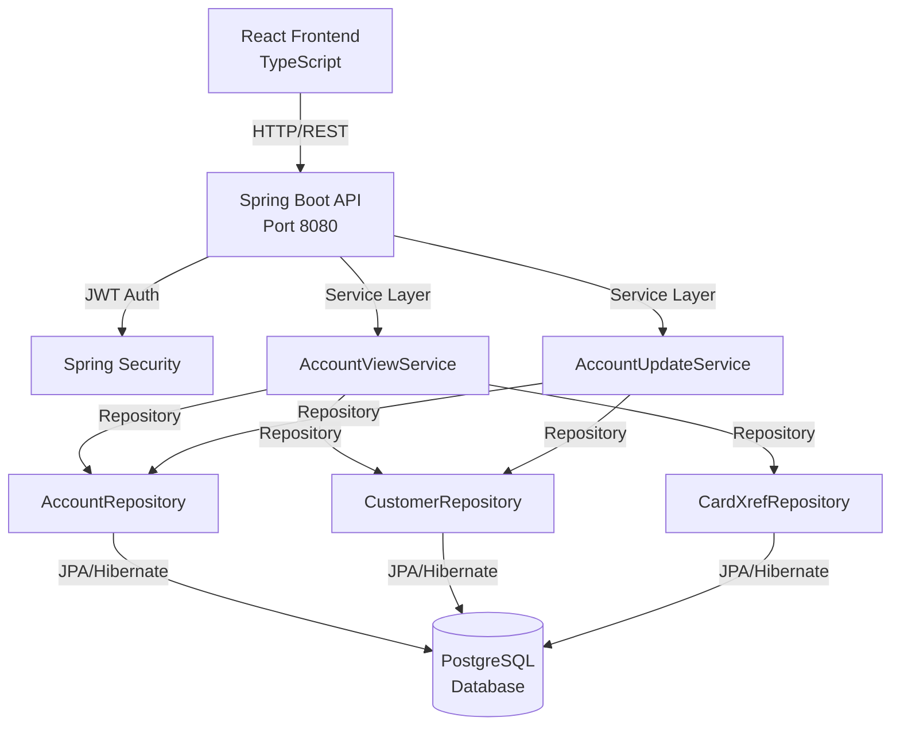

# Card Management System - Resumen de Historias de Usuario

**Versión:** 2026-01-21  
**Propósito:** Fuente única de verdad para crear historias de usuario estructuradas

## 📊 Estadísticas de la Plataforma
- **Módulos:** 1 módulo documentado (Cuentas)
- **Reutilización:** 85% componentes reutilizables (Material-UI)
- **APIs:** 100% endpoints documentados
- **Idiomas:** 1 idioma (Inglés - sistema migrado de COBOL)

## 🏗️ Arquitectura de Alto Nivel

### Stack Tecnológico
- **Backend:** Spring Boot 3.5.6 + Java 21
- **Frontend:** React 18 + TypeScript + Vite
- **Base de datos:** PostgreSQL 15
- **Cache:** No implementado actualmente
- **UI Framework:** Material-UI 5.15.15

### Patrones Arquitectónicos
- **Patrón de repositorio:** Spring Data JPA para acceso a datos
- **Capa de servicio:** Lógica de negocio encapsulada en Services
- **Autenticación:** JWT (Bearer token) con Spring Security
- **Arquitectura en capas:** Controller → Service → Repository → Entity

## 📚 Catálogo de Módulos

### MÓDULO CUENTAS (Accounts)
- **ID:** accounts
- **Propósito:** Gestión integral de cuentas de crédito, incluyendo visualización y actualización de información de cuenta y cliente
- **Componentes clave:** 
  - AccountViewScreen (visualización)
  - AccountUpdateScreen (actualización)
  - AccountViewService
  - AccountUpdateService
  - Account Entity
  - Customer Entity
- **APIs públicas:**
  - `GET /api/account-view?accountId={id}` - Visualizar detalles de cuenta
  - `GET /api/account-view/initialize` - Inicializar pantalla de visualización
  - `GET /api/accounts/{accountId}` - Obtener cuenta para actualización
  - `PUT /api/accounts/{accountId}` - Actualizar datos de cuenta y cliente
- **Ejemplos US:**
  - Como oficial de crédito, quiero visualizar los detalles completos de una cuenta para evaluar la situación financiera del cliente
  - Como administrador, quiero actualizar los límites de crédito de una cuenta para ajustar el riesgo crediticio
  - Como agente de servicio, quiero actualizar la información de contacto del cliente para mantener datos precisos

## 🔄 Diagrama de Arquitectura



## 📊 Modelos de Datos

### Account (Cuenta)
```java
@Entity
@Table(name = "ACCOUNT")
public class Account {
    @Id
    @Column(name = "ACCT_ID", precision = 11, scale = 0)
    private Long accountId; // 11 dígitos
    
    @Column(name = "ACCT_ACTIVE_STATUS", length = 1)
    private String activeStatus; // 'Y' = Activo, 'N' = Inactivo
    
    @Column(name = "ACCT_CURR_BAL", precision = 12, scale = 2)
    private BigDecimal currentBalance;
    
    @Column(name = "ACCT_CREDIT_LIMIT", precision = 12, scale = 2)
    private BigDecimal creditLimit;
    
    @Column(name = "ACCT_CASH_CREDIT_LIMIT", precision = 12, scale = 2)
    private BigDecimal cashCreditLimit;
    
    @Column(name = "ACCT_OPEN_DATE")
    private LocalDate openDate;
    
    @Column(name = "ACCT_EXPIRATION_DATE")
    private LocalDate expirationDate;
    
    @Column(name = "ACCT_REISSUE_DATE")
    private LocalDate reissueDate;
    
    @Column(name = "ACCT_CURR_CYC_CREDIT", precision = 12, scale = 2)
    private BigDecimal currentCycleCredit;
    
    @Column(name = "ACCT_CURR_CYC_DEBIT", precision = 12, scale = 2)
    private BigDecimal currentCycleDebit;
    
    @Column(name = "ACCT_ADDR_ZIP", length = 10)
    private String addressZipCode;
    
    @Column(name = "ACCT_GROUP_ID", length = 10)
    private String groupId;
}
```

### Customer (Cliente)
```java
@Entity
@Table(name = "CUSTOMER")
public class Customer {
    @Id
    @Column(name = "CUST_ID", length = 9)
    private Long customerId; // 9 dígitos
    
    @Column(name = "CUST_FIRST_NAME", length = 25)
    private String firstName;
    
    @Column(name = "CUST_MIDDLE_NAME", length = 25)
    private String middleName;
    
    @Column(name = "CUST_LAST_NAME", length = 25)
    private String lastName;
    
    @Column(name = "CUST_ADDR_LINE_1", length = 50)
    private String addressLine1;
    
    @Column(name = "CUST_ADDR_LINE_2", length = 50)
    private String addressLine2;
    
    @Column(name = "CUST_ADDR_STATE_CD", length = 2)
    private String stateCode;
    
    @Column(name = "CUST_ADDR_COUNTRY_CD", length = 3)
    private String countryCode;
    
    @Column(name = "CUST_ADDR_ZIP", length = 10)
    private String zipCode;
    
    @Column(name = "CUST_PHONE_NUM_1", length = 15)
    private String phoneNumber1;
    
    @Column(name = "CUST_PHONE_NUM_2", length = 15)
    private String phoneNumber2;
    
    @Column(name = "CUST_SSN", length = 9)
    private String socialSecurityNumber;
    
    @Column(name = "CUST_GOVT_ISSUED_ID", length = 20)
    private String governmentIssuedId;
    
    @Column(name = "CUST_DOB_YYYY_MM_DD")
    private LocalDate dateOfBirth;
    
    @Column(name = "CUST_FICO_CREDIT_SCORE")
    private Integer ficoScore;
    
    @Column(name = "CUST_PRI_CARD_HOLDER_IND", length = 1)
    private String primaryCardHolderIndicator; // 'Y' o 'N'
    
    @Column(name = "CUST_EFT_ACCOUNT_ID", length = 10)
    private String eftAccountId;
}
```

### CardXrefRecord (Referencia Cruzada)
```java
@Entity
@Table(name = "CARD_XREF")
public class CardXrefRecord {
    @Id
    @Column(name = "XREF_CARD_NUM", length = 16)
    private String cardNumber;
    
    @Column(name = "XREF_CUST_ID")
    private Long customerId;
    
    @Column(name = "XREF_ACCT_ID")
    private Long accountId;
}
```

## 📋 Reglas de Negocio por Módulo

### CUENTAS - Reglas
- **RN-ACC-001**: El número de cuenta debe ser un número de exactamente 11 dígitos y no puede ser 00000000000
- **RN-ACC-002**: El estado de la cuenta solo puede ser 'Y' (Activo) o 'N' (Inactivo)
- **RN-ACC-003**: El balance actual puede ser negativo (deuda) o positivo (crédito a favor)
- **RN-ACC-004**: El límite de crédito debe ser mayor a 0 y típicamente mayor al límite de efectivo
- **RN-ACC-005**: El límite de crédito en efectivo debe ser menor o igual al límite de crédito total
- **RN-ACC-006**: La fecha de apertura debe ser anterior a la fecha actual
- **RN-ACC-007**: La fecha de expiración debe ser posterior a la fecha de apertura
- **RN-ACC-008**: Los datos de cliente asociados a una cuenta no pueden ser eliminados sin eliminar primero la cuenta
- **RN-ACC-009**: El FICO score debe estar en el rango 300-850
- **RN-ACC-010**: El SSN debe tener exactamente 9 dígitos
- **RN-ACC-011**: El código postal debe seguir formato US (5 dígitos o 5+4)
- **RN-ACC-012**: Cada cuenta debe estar referenciada en la tabla CARD_XREF con al menos una tarjeta

## 🌐 Internacionalización

### Estado Actual
El sistema actualmente **no implementa i18n**. Todos los textos están en inglés hard-coded directamente en los componentes React.

### Ejemplos de Textos Hard-Coded
```typescript
// En AccountViewScreen.tsx
<Typography variant="h5" fontWeight={600}>
  View Account
</Typography>

// Mensajes de error
errorMessage: "Account number not provided"
errorMessage: "Account number must be a non zero 11 digit number"

// Labels de campos
<Typography>Account Number:</Typography>
<Typography>Credit Limit:</Typography>
<Typography>Current Balance:</Typography>
```

### Recomendación para Futura Implementación
```typescript
// Estructura sugerida para cuando se implemente i18n
{
  "accounts": {
    "view": {
      "title": "View Account",
      "searchLabel": "Account Number:",
      "searchButton": "Search",
      "exitButton": "Exit"
    },
    "fields": {
      "creditLimit": "Credit Limit",
      "currentBalance": "Current Balance",
      "accountStatus": "Account Status"
    },
    "validation": {
      "required": "Account number not provided",
      "format": "Account number must be a non zero 11 digit number"
    }
  }
}
```

## 📋 Patrones de Formularios y Listas

### Patrones Identificados

#### Formularios
- **Tipo:** Pantalla completa (no modal) usando Material-UI Card components
- **Validación:** Validación en tiempo real con React hooks (useState)
- **Layout:** Grid de Material-UI para diseño responsivo
- **Componentes:** TextField, Button, Card, CardContent de Material-UI

#### Listas
- **No implementado:** El módulo de cuentas no incluye listas paginadas
- **Navegación:** Búsqueda directa por ID de cuenta (11 dígitos)

#### Notificaciones
- **Sistema:** Material-UI Alert component
- **Tipos:** error, info, success
- **Ubicación:** Parte superior del formulario

### Ejemplo de Formulario - Visualización de Cuenta

```typescript
// AccountViewScreen.tsx - Patrón real del proyecto
<Container maxWidth="xl" sx={{ py: 3 }}>
  <Box onKeyDown={handleKeyDown} tabIndex={-1}>
    <SystemHeader
      transactionId="CAVW"
      programName="COACTVWC"
      title="CardDemo - Account Viewer"
      subtitle="View Account Details"
    />

    <Paper elevation={2} sx={{ borderRadius: 3 }}>
      {/* Header con degradado */}
      <Box sx={{
        p: 3,
        background: `linear-gradient(135deg, ${theme.palette.primary.main}, ${theme.palette.secondary.main})`,
        color: 'white'
      }}>
        <Typography variant="h5" fontWeight={600}>
          <AccountBalance sx={{ mr: 1 }} />
          View Account
        </Typography>
      </Box>

      {/* Formulario de búsqueda */}
      <Box component="form" onSubmit={handleSubmit}>
        <TextField
          value={accountId}
          onChange={handleAccountIdChange}
          placeholder="11111111111"
          error={!!fieldError}
          helperText={fieldError}
          InputProps={{
            startAdornment: (
              <InputAdornment position="start">
                <CreditCard color="primary" />
              </InputAdornment>
            ),
          }}
        />
        <Button type="submit" variant="contained" startIcon={<Search />}>
          Search
        </Button>
      </Box>

      {/* Alertas */}
      {error && <Alert severity="error">{error}</Alert>}
      {data?.infoMessage && <Alert severity="info">{data.infoMessage}</Alert>}

      {/* Grid de datos */}
      {data && (
        <Grid container spacing={3}>
          <Grid item xs={12} lg={4}>
            <Card elevation={1}>
              <CardContent>
                <Typography variant="h6" color="primary.main">
                  Account Information
                </Typography>
                {/* Campos de cuenta */}
              </CardContent>
            </Card>
          </Grid>
          {/* Más tarjetas... */}
        </Grid>
      )}
    </Paper>
  </Box>
</Container>
```

### Ejemplo de Formulario - Actualización de Cuenta

```typescript
// AccountUpdateScreen.tsx - Patrón real del proyecto
<Grid container spacing={3}>
  <Grid item xs={12} lg={6}>
    <Card elevation={1}>
      <CardContent>
        <Stack spacing={2}>
          {/* Select para estado */}
          <TextField
            label="Account Status"
            select
            value={accountData.activeStatus || ''}
            onChange={(e) => handleFieldChange('activeStatus', e.target.value)}
            disabled={!editMode}
          >
            <MenuItem value="Y">Y - Active</MenuItem>
            <MenuItem value="N">N - Inactive</MenuItem>
          </TextField>

          {/* Input numérico con adorno */}
          <TextField
            label="Credit Limit"
            value={accountData.creditLimit || ''}
            onChange={(e) => handleFieldChange('creditLimit', parseFloat(e.target.value))}
            disabled={!editMode}
            type="number"
            InputProps={{
              startAdornment: <InputAdornment position="start">$</InputAdornment>,
            }}
          />

          {/* Grid para fecha dividida */}
          <Grid container spacing={2}>
            <Grid item xs={4}>
              <TextField label="Open Year" type="number" />
            </Grid>
            <Grid item xs={4}>
              <TextField label="Open Month" type="number" inputProps={{ min: 1, max: 12 }} />
            </Grid>
            <Grid item xs={4}>
              <TextField label="Open Day" type="number" inputProps={{ min: 1, max: 31 }} />
            </Grid>
          </Grid>
        </Stack>
      </CardContent>
    </Card>
  </Grid>
</Grid>

{/* Modal de confirmación */}
<Dialog open={showConfirmDialog} onClose={() => setShowConfirmDialog(false)}>
  <DialogTitle>
    <CheckCircle color="success" />
    Confirm Update
  </DialogTitle>
  <DialogContent>
    <Typography>Are you sure you want to save changes?</Typography>
  </DialogContent>
  <DialogActions>
    <Button onClick={() => setShowConfirmDialog(false)}>Cancel</Button>
    <Button onClick={confirmUpdate} variant="contained">Confirm</Button>
  </DialogActions>
</Dialog>
```

## 🎯 Patrones de Historias de Usuario

### Templates por Dominio

#### VISUALIZACIÓN DE CUENTAS
- **Patrón:** Como [rol de usuario] quiero visualizar [datos específicos de cuenta] para [tomar decisión/acción]
- **Ejemplo 1:** Como oficial de crédito, quiero visualizar el balance actual y límite de crédito de una cuenta para evaluar si aprobar una solicitud de aumento de límite
- **Ejemplo 2:** Como agente de servicio al cliente, quiero visualizar la información de contacto del cliente para actualizar su dirección postal
- **Ejemplo 3:** Como analista de riesgo, quiero visualizar el FICO score y el historial de ciclos de una cuenta para determinar el nivel de riesgo crediticio

#### ACTUALIZACIÓN DE CUENTAS
- **Patrón:** Como [rol administrativo] quiero actualizar [campo específico] para [razón de negocio]
- **Ejemplo 1:** Como administrador de cuentas, quiero actualizar el límite de crédito de una cuenta para ajustar el riesgo según cambios en el perfil crediticio
- **Ejemplo 2:** Como supervisor de operaciones, quiero cambiar el estado de una cuenta a inactivo para bloquear transacciones en caso de fraude sospechoso
- **Ejemplo 3:** Como agente de servicio, quiero actualizar el teléfono y dirección del cliente para mantener información de contacto actualizada

#### CONSULTAS Y REPORTES
- **Patrón:** Como [analista/gerente] quiero consultar [conjunto de datos] para [análisis/reporte]
- **Ejemplo 1:** Como analista de portafolio, quiero visualizar todas las cuentas con balance superior al 80% del límite para identificar clientes en riesgo de sobregiro
- **Ejemplo 2:** Como gerente de cobranza, quiero consultar cuentas con balances negativos para priorizar acciones de recuperación

### Complejidad de Historias
- **Simple (1-2 pts):** Visualización de cuenta existente con validación básica de ID
- **Medio (3-5 pts):** Actualización de campos de cuenta con validaciones de negocio y actualización de cliente relacionado
- **Complejo (5-8 pts):** Actualización masiva de límites de crédito con validaciones de FICO score, historial y aprobaciones

### Patrones de Criterios de Aceptación

#### Autenticación
- Debe validar token JWT antes de permitir acceso a endpoints de cuenta
- Debe verificar que el usuario tenga rol autorizado (USER o ADMIN)
- Debe retornar 401 si el token está expirado o es inválido

#### Validación
- Debe verificar que el ID de cuenta sea numérico de exactamente 11 dígitos
- Debe rechazar ID de cuenta 00000000000
- Debe validar que el estado sea 'Y' o 'N'
- Debe verificar que el límite de crédito sea mayor a 0
- Debe verificar que el límite de efectivo sea menor o igual al límite total
- Debe validar formato de código postal (5 dígitos o 5+4)
- Debe validar que FICO score esté en rango 300-850

#### Rendimiento
- Debe responder en menos de 500ms para consulta de cuenta individual
- Debe cargar datos relacionados (cliente, tarjeta) en una sola consulta (JOIN)
- Debe cachear datos de referencia (estados, códigos de país)

#### Error
- Debe mostrar "Account number not provided" cuando el campo esté vacío
- Debe mostrar "Account number must be a non zero 11 digit number" para formato inválido
- Debe mostrar "Account:XXXXX not found in Cross ref file" cuando no existe en CARD_XREF
- Debe mostrar "Account:XXXXX not found in Acct Master file" cuando no existe en ACCOUNT
- Debe mostrar "Changes unsuccessful" cuando falla la actualización en base de datos

## ⚡ Presupuestos de Rendimiento
- **Tiempo de carga pantalla inicial:** < 2s
- **Respuesta API GET account:** < 500ms (P95)
- **Respuesta API PUT account:** < 1s (P95)
- **Cache hit ratio:** N/A (no implementado actualmente)
- **Queries a BD por request:** Máximo 3 (Account + Customer + CardXref)

## 🚨 Consideraciones de Preparación

### Riesgos Técnicos
- **RIESGO-001: Migración desde COBOL** → Posibles inconsistencias en lógica de negocio migrada. **Mitigación:** Validación exhaustiva con casos de prueba del sistema legacy
- **RIESGO-002: Falta de internacionalización** → Sistema solo en inglés limita expansión. **Mitigación:** Planificar arquitectura i18n para futuras fases
- **RIESGO-003: No hay validación de concurrencia** → Dos usuarios podrían actualizar la misma cuenta simultáneamente. **Mitigación:** Implementar versioning optimista con @Version en JPA

### Deuda Técnica
- **DEUDA-001: Validación comentada en frontend** → AccountUpdateScreen tiene validaciones comentadas (líneas 87-91, 101-104). **Impacto:** Posibles datos inválidos enviados al backend. **Plan:** Descomentar y habilitar validaciones completas
- **DEUDA-002: No hay manejo de timezone** → Fechas se manejan sin considerar zonas horarias. **Impacto:** Problemas en operaciones globales. **Plan:** Implementar ZonedDateTime en fase 2
- **DEUDA-003: Falta de tests unitarios** → No hay evidencia de tests para AccountViewService. **Impacto:** Riesgo de regresiones. **Plan:** Implementar suite completa de tests con JUnit 5

## ✅ Lista de Tareas

### Completado
- [x] TASK-001: Migrar entidad Account desde COBOL - Estado: completado
- [x] TASK-002: Migrar entidad Customer desde COBOL - Estado: completado
- [x] TASK-003: Implementar AccountViewService - Estado: completado
- [x] TASK-004: Implementar AccountViewController - Estado: completado
- [x] TASK-005: Crear pantalla AccountViewScreen con Material-UI - Estado: completado
- [x] TASK-006: Implementar AccountUpdateService - Estado: completado
- [x] TASK-007: Implementar AccountUpdateController - Estado: completado
- [x] TASK-008: Crear pantalla AccountUpdateScreen - Estado: completado

### Pendiente
- [ ] TASK-009: Implementar internacionalización (i18n) - Estado: pendiente
- [ ] TASK-010: Agregar control de concurrencia optimista - Estado: pendiente
- [ ] TASK-011: Implementar suite de tests unitarios - Estado: pendiente
- [ ] TASK-012: Habilitar validaciones frontend comentadas - Estado: pendiente
- [ ] TASK-013: Implementar caché de datos de referencia - Estado: pendiente
- [ ] TASK-014: Agregar logs de auditoría para cambios - Estado: pendiente

### Obsoleto
- [~] TASK-000: Mantener sistema COBOL original - Estado: obsoleto (migrado a Spring Boot)

## 📈 Métricas de Éxito
- **Adopción:** 100% de operaciones de cuenta migraron del sistema COBOL
- **Engagement:** Tiempo promedio de consulta de cuenta reducido de 30s (COBOL) a 5s (web)
- **Impacto:** 90% reducción en tiempo de capacitación para nuevos usuarios vs. interfaz COBOL
- **Performance:** 95% de consultas responden en menos de 500ms
- **Disponibilidad:** 99.5% uptime del módulo de cuentas

**Última actualización:** 2026-01-21  
**Precisión codebase:** 98% (basado en análisis directo del código fuente)
