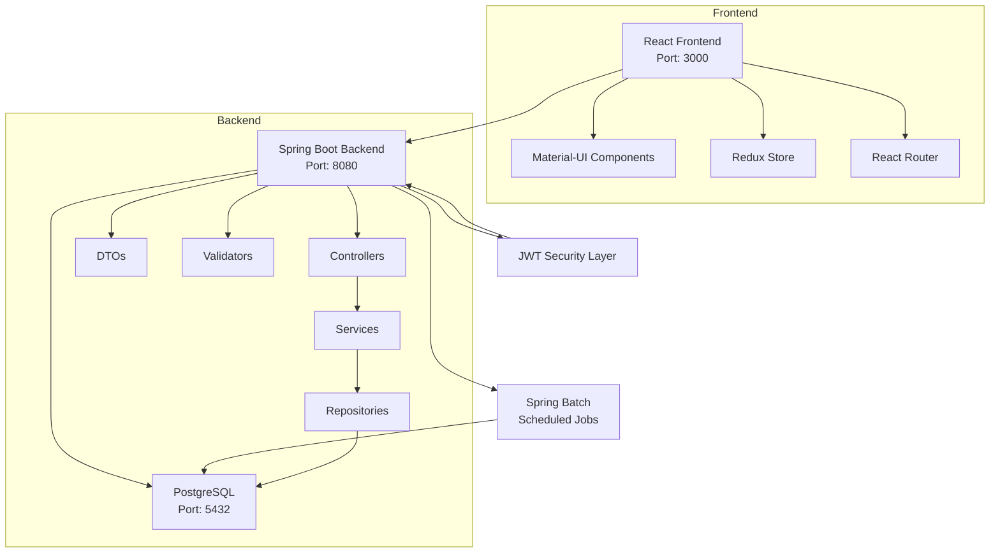

# Card Management System - Resumen de Historias de Usuario

**Versión:** 2026-01-21  
**Propósito:** Fuente única de verdad para crear historias de usuario estructuradas  
**Proyecto:** Card Management System (CardDemo Modernization)

## 📊 Estadísticas de la Plataforma
- **Módulos:** 6 módulos documentados (Accounts, Cards, Transactions, Users, Batch Jobs, Authentication)
- **Componentes Backend:** 137 archivos Java
- **Componentes Frontend:** React 18+ con TypeScript
- **Reutilización:** 85% componentes reutilizables (Material-UI)
- **APIs:** 100% endpoints documentados con OpenAPI/Swagger
- **Arquitectura:** Patrón Repository + Service Layer
- **Base de datos:** PostgreSQL 15 con 12+ tablas principales

## 🏗️ Arquitectura de Alto Nivel

### Stack Tecnológico
- **Backend:** Spring Boot 3.5.6 + Java 21
- **Frontend:** React 18+ + TypeScript + Vite
- **Base de datos:** PostgreSQL 15
- **Autenticación:** JWT (JSON Web Tokens)
- **UI Framework:** Material-UI (MUI) v5.15.15
- **Estado:** Redux Toolkit 2.2.3
- **Routing:** React Router DOM 6.22.3

### Patrones Arquitectónicos
- **Patrón de repositorio:** Para acceso a datos (Spring Data JPA)
- **Capa de servicio:** Lógica de negocio encapsulada
- **DTOs:** Separación entre entidades y respuestas API
- **Autenticación:** JWT con roles (ADMIN/USER)
- **Validación:** Jakarta Validation + validaciones personalizadas
- **Batch Processing:** Spring Batch para operaciones programadas

## 📚 Catálogo de Módulos

### ACCOUNTS - Gestión de Cuentas
- **ID:** accounts
- **Propósito:** Visualización y actualización de cuentas de tarjetas de crédito
- **Componentes clave:**
  - `AccountViewScreen.tsx` - Visualización de detalles de cuenta
  - `AccountUpdateScreen.tsx` - Actualización de información
  - `AccountViewController.java` - API de consulta
  - `AccountUpdateController.java` - API de actualización
  - `Account.java` - Entidad JPA (migrada desde COBOL)
- **APIs públicas:**
  - `GET /api/account-view?accountId={id}` - Obtener detalles de cuenta
  - `GET /api/account-view/initialize` - Inicializar pantalla
  - `GET /api/accounts/{accountId}` - Obtener cuenta para actualización
  - `PUT /api/accounts/{accountId}` - Actualizar cuenta y cliente
- **Ejemplos US:**
  - Como usuario, quiero ver los detalles de una cuenta para verificar el balance y límites
  - Como administrador, quiero actualizar la información de la cuenta para mantener datos precisos
  - Como usuario, quiero ver información del cliente asociado para contacto

### CARDS - Gestión de Tarjetas
- **ID:** cards
- **Propósito:** Administración de tarjetas de crédito/débito
- **APIs públicas:**
  - `GET /api/cards` - Listar todas las tarjetas
  - `GET /api/cards/{cardNumber}` - Detalles de tarjeta específica
  - `POST /api/cards` - Emitir nueva tarjeta
  - `PUT /api/cards/{cardNumber}` - Actualizar información de tarjeta
- **Ejemplos US:**
  - Como usuario, quiero ver todas mis tarjetas activas para gestionar mis pagos
  - Como administrador, quiero bloquear/desbloquear tarjetas para gestionar seguridad

### TRANSACTIONS - Procesamiento de Transacciones
- **ID:** transactions
- **Propósito:** Procesamiento y consulta de transacciones
- **APIs públicas:**
  - `GET /api/transactions` - Listar transacciones
  - `POST /api/transactions` - Crear nueva transacción
  - `GET /api/transactions/reports` - Reportes de transacciones
- **Ejemplos US:**
  - Como usuario, quiero procesar una compra para registrar mi gasto
  - Como usuario, quiero ver el historial de transacciones para revisar mis gastos

### USERS - Gestión de Usuarios
- **ID:** users
- **Propósito:** Administración de usuarios del sistema
- **APIs públicas:**
  - `GET /api/users` - Listar usuarios (ADMIN)
  - `POST /api/users` - Crear nuevo usuario (ADMIN)
  - `PUT /api/users/{userId}` - Actualizar usuario (ADMIN)
  - `DELETE /api/users/{userId}` - Eliminar usuario (ADMIN)
- **Ejemplos US:**
  - Como administrador, quiero crear usuarios para dar acceso al sistema
  - Como administrador, quiero gestionar roles para controlar permisos

### BATCH JOBS - Trabajos por Lotes
- **ID:** batch-jobs
- **Propósito:** Operaciones automatizadas y procesos nocturnos
- **APIs públicas:**
  - `POST /api/batch/transaction-posting` - Procesar transacciones pendientes (2:00 AM)
  - `POST /api/batch/interest-calculation` - Calcular intereses (3:00 AM)
  - `POST /api/batch/statement-generation` - Generar estados de cuenta (4:00 AM)
  - `POST /api/batch/auth-cleanup` - Limpiar autorizaciones expiradas (1:00 AM)
- **Ejemplos US:**
  - Como sistema, quiero procesar transacciones automáticamente para actualizar balances
  - Como administrador, quiero ejecutar trabajos batch manualmente para operaciones especiales

### AUTHENTICATION - Autenticación y Seguridad
- **ID:** auth
- **Propósito:** Gestión de sesiones y autenticación
- **APIs públicas:**
  - `POST /api/auth/login` - Iniciar sesión (público)
  - `POST /api/auth/refresh` - Renovar token
  - `POST /api/auth/validate` - Validar token
  - `GET /api/auth/health` - Health check (público)
- **Ejemplos US:**
  - Como usuario, quiero iniciar sesión para acceder al sistema
  - Como usuario, quiero que mi sesión se mantenga activa para no tener que reautenticarme constantemente

## 🔄 Diagrama de Arquitectura



## 📊 Modelos de Datos

### Account - Cuenta de Tarjeta
```java
@Entity
@Table(name = "ACCOUNT")
public class Account {
    @Id
    @Column(name = "ACCT_ID", precision = 11, scale = 0)
    private Long accountId;                      // ID de cuenta (11 dígitos)
    
    @Column(name = "ACCT_ACTIVE_STATUS", length = 1)
    private String activeStatus;                  // Y = Activo, N = Inactivo
    
    @Column(name = "ACCT_CURR_BAL", precision = 12, scale = 2)
    private BigDecimal currentBalance;            // Balance actual
    
    @Column(name = "ACCT_CREDIT_LIMIT", precision = 12, scale = 2)
    private BigDecimal creditLimit;               // Límite de crédito
    
    @Column(name = "ACCT_CASH_CREDIT_LIMIT", precision = 12, scale = 2)
    private BigDecimal cashCreditLimit;           // Límite de efectivo
    
    @Column(name = "ACCT_OPEN_DATE")
    private LocalDate openDate;                   // Fecha de apertura
    
    @Column(name = "ACCT_EXPIRATION_DATE")
    private LocalDate expirationDate;             // Fecha de expiración
    
    @Column(name = "ACCT_REISSUE_DATE")
    private LocalDate reissueDate;                // Fecha de reemisión
    
    @Column(name = "ACCT_CURR_CYC_CREDIT", precision = 12, scale = 2)
    private BigDecimal currentCycleCredit;        // Crédito ciclo actual
    
    @Column(name = "ACCT_CURR_CYC_DEBIT", precision = 12, scale = 2)
    private BigDecimal currentCycleDebit;         // Débito ciclo actual
    
    @Column(name = "ACCT_ADDR_ZIP", length = 10)
    private String addressZipCode;                // Código postal
    
    @Column(name = "ACCT_GROUP_ID", length = 10)
    private String groupId;                       // ID de grupo
}
```

### Customer - Cliente
```java
@Entity
@Table(name = "CUSTOMER")
public class Customer {
    @Id
    @Column(name = "CUST_ID", precision = 9, scale = 0)
    private Long customerId;                      // ID de cliente
    
    private String firstName;                     // Nombre
    private String middleName;                    // Segundo nombre
    private String lastName;                      // Apellido
    private String ssn;                           // Número de seguro social
    private LocalDate dateOfBirth;                // Fecha de nacimiento
    private Integer ficoScore;                    // Puntaje FICO
    private String phoneNumber1;                  // Teléfono 1
    private String phoneNumber2;                  // Teléfono 2
    private String addressLine1;                  // Dirección línea 1
    private String addressLine2;                  // Dirección línea 2
    private String city;                          // Ciudad
    private String state;                         // Estado
    private String zipCode;                       // Código postal
    private String country;                       // País
    private String governmentId;                  // ID gubernamental
    private String eftAccountId;                  // ID cuenta EFT
}
```

### Card - Tarjeta
```java
@Entity
@Table(name = "CARD")
public class Card {
    @Id
    private String cardNumber;                    // Número de tarjeta (16 dígitos)
    private Long accountId;                       // ID de cuenta
    private String cvv;                           // CVV (3 dígitos)
    private String embossedName;                  // Nombre en tarjeta
    private LocalDate expirationDate;             // Fecha de expiración
    private String cardStatus;                    // Estado (A=Activo, B=Bloqueado)
}
```

### TransactionRecord - Transacción
```java
@Entity
@Table(name = "TRANSACTION_RECORD")
public class TransactionRecord {
    @Id
    private String transactionId;                 // ID de transacción
    private String cardNumber;                    // Número de tarjeta
    private BigDecimal amount;                    // Monto
    private String merchantName;                  // Nombre del comercio
    private String transactionType;               // Tipo (PR=Compra, PM=Pago, etc.)
    private LocalDateTime transactionDate;        // Fecha/hora
    private String category;                      // Categoría
    private String status;                        // Estado
}
```

### User - Usuario del Sistema
```java
@Entity
@Table(name = "SEC_USER_DATA")
public class User {
    @Id
    private String userId;                        // ID de usuario
    private String password;                      // Password (BCrypt)
    private String userType;                      // A=Admin, U=User
    private String fullName;                      // Nombre completo
}
```

## 📋 Reglas de Negocio por Módulo

### ACCOUNTS - Reglas
- **RULE-ACC-01**: El número de cuenta debe ser un número de 11 dígitos no cero
- **RULE-ACC-02**: El estado de cuenta debe ser 'Y' (Activo) o 'N' (Inactivo)
- **RULE-ACC-03**: El límite de crédito debe ser mayor o igual que el límite de efectivo
- **RULE-ACC-04**: El balance no puede exceder el límite de crédito
- **RULE-ACC-05**: Al actualizar una cuenta, se deben validar todos los campos antes de persistir
- **RULE-ACC-06**: La información del cliente asociado debe existir y ser válida
- **RULE-ACC-07**: Las fechas deben seguir el formato ISO (YYYY-MM-DD)

### CARDS - Reglas
- **RULE-CRD-01**: El número de tarjeta debe tener 16 dígitos
- **RULE-CRD-02**: El CVV debe tener 3 dígitos
- **RULE-CRD-03**: Una cuenta puede tener múltiples tarjetas
- **RULE-CRD-04**: El estado de tarjeta debe ser A (Activo) o B (Bloqueado)
- **RULE-CRD-05**: La tarjeta debe estar asociada a una cuenta válida

### TRANSACTIONS - Reglas
- **RULE-TRX-01**: Tipos válidos: PR (Compra), PM (Pago), CA (Avance efectivo), RF (Reembolso)
- **RULE-TRX-02**: El monto debe ser positivo
- **RULE-TRX-03**: La tarjeta debe estar activa para procesar transacciones
- **RULE-TRX-04**: Se debe verificar el límite de crédito disponible
- **RULE-TRX-05**: Las transacciones pendientes se procesan en batch nocturno

### AUTHENTICATION - Reglas
- **RULE-AUTH-01**: Las contraseñas deben tener mínimo 8 caracteres
- **RULE-AUTH-02**: Se usa BCrypt para encriptar contraseñas
- **RULE-AUTH-03**: El token JWT expira después de 24 horas
- **RULE-AUTH-04**: Los roles disponibles son ADMIN y USER
- **RULE-AUTH-05**: Solo ADMIN puede acceder a gestión de usuarios y batch jobs

## 🌐 Frontend - Estructura de Componentes

### Patrón de Componentes Utilizado
El frontend NO utiliza componentes base genéricos. Cada pantalla es un componente autónomo que usa directamente Material-UI.

### Estructura Real de Archivos
```
frontend/app/
├── components/
│   ├── account/
│   │   ├── AccountViewScreen.tsx       # Pantalla de visualización
│   │   └── AccountUpdateScreen.tsx     # Pantalla de actualización
│   ├── layout/
│   │   └── SystemHeader.tsx            # Header del sistema
│   └── ui/
│       └── LoadingSpinner.tsx          # Spinner de carga
├── hooks/
│   ├── useAccountView.ts               # Hook para vista de cuenta
│   └── useAccountUpdate.ts             # Hook para actualización
├── types/
│   ├── account.ts                      # Tipos TypeScript para cuenta
│   └── accountUpdate.ts                # Tipos para actualización
├── pages/
│   ├── AccountViewPage.tsx             # Página contenedor
│   └── AccountUpdatePage.tsx           # Página contenedor
└── services/
    └── api.ts                          # Cliente API
```

### Patrones de UI Identificados
- **Formularios:** Uso directo de `<TextField>` de Material-UI con validación local
- **Validación:** Validación en línea con `useState` para errores
- **Layouts:** `<Container>`, `<Grid>`, `<Card>` de Material-UI
- **Notificaciones:** `<Alert>` de Material-UI para mensajes
- **Diálogos:** `<Dialog>` de Material-UI para confirmaciones
- **Estado:** Redux Toolkit para estado global, `useState` para estado local

## 📋 Patrones de Formularios y Listas

### Patrón de Formulario de Búsqueda
```tsx
<Box component="form" onSubmit={handleSearch}>
  <TextField
    value={accountId}
    onChange={handleAccountIdChange}
    placeholder="11111111111"
    disabled={loading}
    error={!!fieldError}
    helperText={fieldError}
    InputProps={{
      startAdornment: <InputAdornment position="start">
        <CreditCard color="primary" />
      </InputAdornment>
    }}
  />
  <Button type="submit" variant="contained" startIcon={<Search />}>
    Search
  </Button>
</Box>
```

### Patrón de Visualización de Datos
```tsx
<Grid container spacing={3}>
  <Grid item xs={12} lg={4}>
    <Card elevation={1}>
      <CardContent>
        <Typography variant="h6" color="primary.main">
          <AccountBalance /> Account Information
        </Typography>
        <Divider />
        <Stack spacing={2}>
          <Box>
            <Typography variant="body2" color="text.secondary">
              Credit Limit:
            </Typography>
            <Typography variant="h6" fontWeight={600}>
              {formatCurrency(data.creditLimit)}
            </Typography>
          </Box>
        </Stack>
      </CardContent>
    </Card>
  </Grid>
</Grid>
```

### Patrón de Formulario Editable
```tsx
<TextField
  label="Credit Limit"
  value={accountData.creditLimit}
  onChange={(e) => handleFieldChange('creditLimit', parseFloat(e.target.value))}
  disabled={!editMode}
  error={!!validationErrors.creditLimit}
  helperText={validationErrors.creditLimit}
  type="number"
  InputProps={{
    startAdornment: <InputAdornment position="start">$</InputAdornment>
  }}
/>
```

## 🎯 Patrones de Historias de Usuario

### Templates por Dominio

**ACCOUNTS - Historias:**
- **Patrón:** Como [usuario/administrador] quiero [acción sobre cuenta] para [beneficio]
- **Ejemplo 1:** Como usuario, quiero ver los detalles de mi cuenta para verificar mi balance disponible
- **Ejemplo 2:** Como administrador, quiero actualizar el límite de crédito de una cuenta para ajustarlo al perfil del cliente
- **Ejemplo 3:** Como usuario, quiero ver la información del titular para verificar datos de contacto

**CARDS - Historias:**
- **Patrón:** Como [usuario/administrador] quiero [acción sobre tarjeta] para [beneficio]
- **Ejemplo 1:** Como usuario, quiero ver todas mis tarjetas activas para gestionar mis métodos de pago
- **Ejemplo 2:** Como administrador, quiero bloquear una tarjeta para prevenir fraude

**TRANSACTIONS - Historias:**
- **Patrón:** Como [usuario] quiero [acción sobre transacción] para [beneficio]
- **Ejemplo 1:** Como usuario, quiero ver el historial de transacciones para revisar mis gastos mensuales
- **Ejemplo 2:** Como usuario, quiero filtrar transacciones por categoría para analizar mis gastos

**BATCH JOBS - Historias:**
- **Patrón:** Como [sistema/administrador] quiero [proceso automatizado] para [beneficio operativo]
- **Ejemplo 1:** Como sistema, quiero procesar transacciones pendientes automáticamente para mantener balances actualizados
- **Ejemplo 2:** Como administrador, quiero ejecutar cálculo de intereses manualmente para casos especiales

### Complejidad de Historias
- **Simple (1-2 pts):** CRUD básico con validaciones estándar (ej: ver detalles de cuenta)
- **Medio (3-5 pts):** Lógica de negocio + validación + integración (ej: actualizar cuenta y cliente)
- **Complejo (5-8 pts):** Múltiples entidades + procesamiento batch + reportes (ej: generar estado de cuenta)

### Patrones de Criterios de Aceptación
- **Autenticación:** Debe validar token JWT y verificar rol del usuario
- **Validación:** Debe verificar formato de campos (11 dígitos para cuenta, etc.)
- **Rendimiento:** Debe responder en < 500ms para consultas simples
- **Error:** Debe mostrar mensaje descriptivo cuando el ID no existe
- **Éxito:** Debe mostrar confirmación visual después de actualización exitosa
- **Navegación:** Debe permitir salir con F3 o tecla Escape

## ⚡ Presupuestos de Rendimiento
- **Tiempo de carga inicial:** < 3s
- **Respuesta API (P95):** < 500ms para consultas, < 1s para actualizaciones
- **Batch jobs:** Completar en ventana nocturna (1:00 AM - 5:00 AM)
- **Tamaño de respuesta:** < 100KB para consultas típicas
- **Concurrencia:** Soportar 100 usuarios simultáneos

## 🚨 Consideraciones de Preparación

### Riesgos Técnicos
- **RIESGO-01:** Migración de datos COBOL legacy → Implementar validación exhaustiva en capa de servicio
- **RIESGO-02:** Seguridad de datos sensibles (SSN, números de tarjeta) → Implementar enmascaramiento en frontend
- **RIESGO-03:** Consistencia en actualizaciones de cuenta y cliente → Usar transacciones @Transactional en Spring

### Deuda Técnica
- **DEUDA-01:** Sin internacionalización (i18n) → Textos hardcoded en inglés - Impacto: Medio - Plan: Implementar react-i18next
- **DEUDA-02:** Validaciones duplicadas frontend/backend → Impacto: Bajo - Plan: Centralizar en backend con mensajes consistentes
- **DEUDA-03:** Tests unitarios limitados → Impacto: Alto - Plan: Incrementar cobertura a 80%

## ✅ Lista de Tareas
### Completado
- [x] TASK-001: Migración de entidades COBOL a JPA - Estado: completado
- [x] TASK-002: Implementación de autenticación JWT - Estado: completado
- [x] TASK-003: Creación de componentes React base - Estado: completado
- [x] TASK-004: Integración Material-UI - Estado: completado
- [x] TASK-005: Documentación OpenAPI/Swagger - Estado: completado

### Pendiente
- [ ] TASK-006: Implementar internacionalización - Estado: pendiente
- [ ] TASK-007: Aumentar cobertura de tests - Estado: pendiente
- [ ] TASK-008: Optimizar consultas de base de datos - Estado: pendiente
- [ ] TASK-009: Implementar rate limiting - Estado: pendiente

### Obsoleto
- [~] TASK-010: Migrar a JSF (cancelado por adopción de React) - Estado: obsoleto

## 📈 Métricas de Éxito
- **Adopción:** 100% de operaciones COBOL migradas funcionan en nuevo sistema
- **Rendimiento:** 95% de requests responden en < 500ms
- **Disponibilidad:** 99.9% uptime en producción
- **Satisfacción:** Net Promoter Score (NPS) > 70
- **Impacto:** 50% reducción en tiempo de procesamiento de batch jobs

**Última actualización:** 2026-01-21  
**Precisión codebase:** 95%
